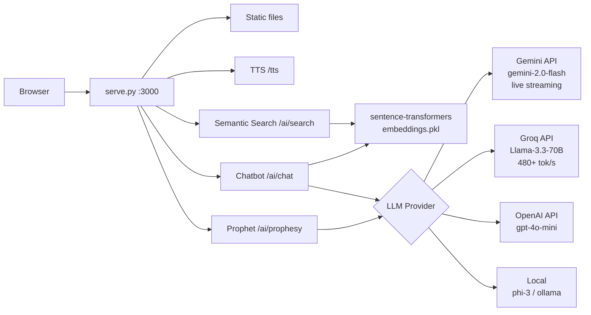

# Just Cause We Can

> *"And the IT department looked upon the codebase, and saw that it was good — but also that it lacked a soul. So they said: let us summon the machine spirit, just cause we can."*

---

## Project Audit

**IT Bible** — v1.0.0 — 61 books, 397 warnings, 1340 verses

### Stack

| Layer | Tech |
|---|---|
| Runtime | Python 3.10+ |
| Server | `http.server` (stdlib) |
| Frontend | Vanilla HTML/CSS/JS |
| Content | Markdown (61 files in `volumes/`) |
| Index | Regex-generated `index.json` |
| TTS | `edge-tts` (4 neural voices, duet narration) |
| Package mgmt | `uv` |
| CI | GitHub Actions (stats auto-update) |
| Image export | `html2canvas` (CDN) |

### What It Does Well

- Zero-dependency frontend (no framework, no bundler)
- Creative multi-voice TTS with character splits
- Clean dark-themed UI with search, copy, PNG export
- CI pipeline auto-updates README stats on content pushes
- Humorous, consistent tone across 61 chapters

### What It's Missing (AI Opportunities)

- **Search is dumb** — regex substring match only, no semantic understanding
- **No natural language interface** — users can't describe their problem and get matched warnings
- **No content generation** — new chapters must be hand-written
- **No intelligence** — the app is a static catalog, not an interactive tool
- **No personalization** — every user sees the same thing; no query context
- **Embedding deps already installed** — `sentence-transformers`, `torch`, `onnxruntime` are all in `uv.lock` but unused

---

## AI Integration Scenarios

### 1. Semantic Search *(MVP — High Value, Low Effort)*

Replace the current substring filter with embedding-based search.

- **How**: Sentence-transformers (already in lockfile) to embed all warning titles + bullets at startup. Query endpoint embeds the question, returns top-k by cosine similarity.
- **Endpoints**: `POST /ai/search` with `{q: "my monitor won't turn on"}` → returns matched warnings with similarity scores
- **Frontend**: Upgrade search box to show relevance-ranked results across all chapters
- **Why**: Users describe problems in natural language, not keywords. "My computer is making a funny noise" should find liquid damage + hardware warnings.
- **Model**: `all-MiniLM-L6-v2` (fast, ~25MB, runs on CPU)
- **Effort**: 2-3 files, ~100 lines of Python + ~30 lines JS

### 2. AI Chatbot — "Ask the IT Bible" *(Signature Feature)*

A chatbot that answers IT questions in full biblical prose.

- **How**: RAG pipeline: embed query → retrieve top warnings → prompt an LLM to synthesize a response in the voice of a prophet
- **Frontend**: Chat bubble in bottom-right corner of the site
- **Design options**:
  - **Option A** (local): `phi-3-mini` or `llama.cpp` with a small 3B model → entirely offline, no API costs
  - **Option B** (hybrid): Local embedding + cloud API for generation → higher quality, costs pennies or free
  - **Option C** (pure local): `transformers` pipeline using the already-installed torch + a quantized model
- **Provider backends**:
  - **Gemini** (`google-genai` SDK v2.7.0) — use `gemini-3.5-flash` (current flagship) or `gemini-2.5-pro` (reasoning). Live/streaming via `generate_content_stream()`. Free tier (60 req/min). SSE streaming via `/ai/chat/stream?provider=gemini`.
  - **Groq** (OpenAI-compatible, `base_url=https://api.groq.com/openai/v1`) — fastest inference anywhere. Use `openai` Python SDK. Top picks: `llama-3.1-8b-instant` (560 tok/s, $0.05/M), `llama-3.3-70b-versatile` (280 tok/s, $0.59/M), `meta-llama/llama-4-scout-17b-16e-instruct` (750 tok/s, preview), `openai/gpt-oss-120b` (500 tok/s). Free tier available.
  - **OpenAI** — `gpt-4o-mini` for highest quality, trivial SSE streaming.
  - **Local** — phi-3 / ollama / llama.cpp, zero cost, slower.
- **Persona**: "Thus saith the IT department. Thou hast plugged thy monitor into thy surge protector and not thy tower. Repent, and thy display shall be restored."
- **Effort**: 4-5 files, ~200 lines Python, ~100 lines JS

### 3. AI Prophet — Content Generation Tool

Generate new warnings / mini-chapters from a 1-sentence user description.

- **How**: Few-shot prompt with 3-5 existing warnings as examples, user provides "what happened", AI generates `**BEFORE YOU ...**` + bullet "verses" in matching format
- **Output**: Conforms to `CONTRIBUTING.md` format — ready to paste as a PR
- **Design**: OpenAI API or local LLM via litellm
- **Vibe**: "Tell me your IT horror story and I shall scribe it as scripture"
- **Effort**: 1-2 endpoints, ~80 lines Python

### 4. Smart Auto-Categorization

Given a new IT horror story, predict which chapter it belongs to.

- **How**: Zero-shot classification via `sentence-transformers` or a fine-tuned lightweight classifier
- **Use**: Assist contributors in placing new content; auto-tag submissions
- **Effort**: ~50 lines, all on existing deps

### 5. "IT Prophecy" — Oracle Mode

A fun gimmick: ask the oracle what error you will encounter today.

- **How**: Random weighted selection + LLM embellishment. "The Oracle of IT foresees... a printer jam before noon."
- **Frontend**: Button on the sidebar that reveals a dramatic prophecy card
- **Effort**: ~40 lines Python, ~20 lines JS

### 6. Image Generation for Warning Cards

Replace the text-only PNG export with AI-generated dramatic imagery.

- **How**: Stable Diffusion (via `diffusers` or Replicate API) to create biblical-style illustrations for each warning
- **Frontend**: "Generate Prophecy Art" button on warning cards
- **Design**: Lazy generation on first click, cache result; or batch pre-generate for all warnings
- **Effort**: Moderate — API integration is simple, local SD requires GPU

### 7. Voice Cloning for TTS Characters

Upgrade from edge-tts presets to cloned voices for named characters (Karin, Karen, The Printer, etc.).

- **How**: Coqui TTS or OpenAI TTS with voice cloning; serve via existing `/tts` endpoint
- **Why**: Character consistency across warnings — "Karin" should sound like the same person every time
- **Effort**: Depends on approach — Coqui is complex, OpenAI is simple but paid

### 8. Interactive "Confession" Booth / Ticket Simulator

A choose-your-own-adventure where users describe an IT problem and get judged in real-time.

- **How**: Multi-turn chat with a strict persona (The IT Priest). Each user message triggers RAG + LLM response. Tracks "sin count" and absolves with assigned warnings as penance.
- **Frontend**: Full-screen modal with typewriter text, dramatic red lighting CSS, confession counter
- **Vibe**: "Forgive me, Father, for I have plugged in the wrong cable."
- **Effort**: ~150 lines Python, ~100 lines JS

### 9. Discord / Slack Bot Integration

Bring the IT Bible directly into the channels where IT support happens.

- **How**: Lightweight bot using `discord.py` or Slack SDK. Commands: `/itbible random`, `/itbible search <problem>`, `/itbible confess`, `/itbible oracle`
- **Design**: Standalone bot process that imports the same search/index/LLM modules from `serve.py`. Or embed a minimal HTTP client that calls the AI endpoints.
- **Why**: IT teams live in chat. Meeting them there is the highest-leverage distribution channel.
- **Effort**: ~200 lines Python per platform

### 10. REST API for Programmatic Access

Expose all warnings + AI features as a proper JSON API for third-party consumption.

- **How**: Add `/api/v1/warnings` (list all), `/api/v1/warnings/:id` (single), `/api/v1/search?q=...`, `/api/v1/random`, `/api/v1/stats`
- **Auth**: Optional API key header for rate limit tracking
- **Why**: Enables integration scripts, custom dashboards, CI pipelines that post a warning on build failure
- **Effort**: ~80 lines Python, zero frontend

### 11. Ticketing System Integration (Jira / ServiceNow / Zendesk)

Auto-suggest matching warnings when creating or viewing a support ticket.

- **How**: Webhook receiver or browser extension that reads ticket description → calls `/ai/search` → appends relevant warnings as a comment or sidebar panel
- **Design options**:
  - **Jira**: Connect via REST API + webhooks. Add "IT Bible Warnings" panel in issue view via Atlassian Forge app.
  - **ServiceNow**: Custom UI Macro or REST Message that calls the API.
  - **Zendesk**: Sidebar app in Apps Marketplace or trigger-based webhook that appends to tickets.
- **Why**: This is the highest real-world utility — closing the loop between the Bible and actual support workflows
- **Effort**: 1-2 days per platform, mostly auth boilerplate

### 12. Browser Extension

A lightweight extension that scans support portals and highlights matching IT Bible warnings in real time.

- **How**: Content script that reads page text → matches against indexed warnings via local embedding or calls `/ai/search`. Overlays a small "⚠️ IT Bible" badge with matching warning count.
- **Targets**: Zendesk, Jira, Freshdesk, generic ticketing portals
- **Why**: Passive value — users don't need to actively search; the Bible finds them
- **Effort**: ~150 lines JS (manifest v3), ~50 lines for a bundled wasm/minilm embedding option

### 13. Multi-Language Translation of Warnings

Translate all 61 books into target languages using Gemini/Groq batch translation.

- **How**: Batch pipeline that sends each warning title + bullets to an LLM with `"Translate this to {lang} in the same biblical style"`. Store as `volumes/*.{lang}.md`. Frontend language picker.
- **Target languages**: Spanish, French, German, Japanese, Korean, Portuguese, Hindi — wherever IT support happens
- **Design**: One-time batch job + `Accept-Language` header detection in the frontend. Cache translations in index.json per language.
- **LLM cost**: ~100K tokens total per language at Groq prices = pennies
- **Effort**: ~100 lines Python batch script, ~50 lines frontend

### 14. Interactive Flowchart / Diagnostic Tree

A branching decision tree that guides users to the right warning based on symptoms.

- **How**: Define a `tree.json` with decision nodes (yes/no questions). Each leaf links to a warning ID. AI can also suggest paths dynamically. Frontend renders as a chat-like flow.
- **Example**: "Is your computer making noise?" → Yes → "Is it a clicking sound?" → Yes → **Warning: Hard Drive Graveyard**
- **Effort**: ~60 lines JSON structure, ~150 lines JS frontend

### 15. User-Submitted Warning System with Voting

Let the community contribute and curate new warnings.

- **How**: `/api/warnings/submit` endpoint. Store submissions in `submissions.json`. Voting via thumbs up/down. Threshold-based promotion to actual PR.
- **Frontend**: "Submit a Warning" form + "Trending Submissions" sidebar
- **AI assist**: Auto-categorize submissions, check format compliance, flag duplicates via embedding similarity
- **Why**: Crowdsourcing makes the Bible truly community-driven
- **Effort**: ~150 lines Python, ~100 lines JS

### 16. Auto-Generate RFC / Change Request Documents in Biblical Style

Generate absurdly over-dramatic IT documentation.

- **How**: `/api/rfc` endpoint. Input: what you're changing. Output: RFC written in the style of Leviticus. "And lo, the database schema was changed from third normal form to fifth, and the engineers saw that it was good."
- **Frontend**: Form → preview → copy as Markdown
- **Effort**: ~60 lines

### 17. AI-Powered Ticket Response Generator

Draft responses to user tickets in the IT Bible's voice.

- **How**: Prompt: "A user says: '{message}'. Draft a response quoting relevant IT Bible warnings, firm but helpful, in biblical style."
- **Frontend**: Paste ticket text → get response + quoted warnings. "Copy to clipboard" button.
- **Why**: IT staff can paste a user's message and get a perfectly-crafted "thou shalt" reply
- **Effort**: ~50 lines

### 18. Sentiment Analysis on IT Tickets

Analyze ticket tone and escalate based on biblical prophecy.

- **How**: LLM prompt or fine-tuned classifier scores tickets on rage ↔ calm spectrum. If rage exceeds threshold, appends a "Prophecy of Escalation" warning to the ticket.
- **Output**: JSON with `{sentiment: "wrathful" | "confused" | "penitent", score: 0.95, prophecy: "..."}`
- **Effort**: ~40 lines with LLM, ~150 lines for a custom classifier

### 19. "This Week in IT" Newsletter / Digest Generator

Auto-generate a weekly newsletter of top warnings, most-viewed, trending.

- **How**: Cron job or manual trigger. Uses analytics data (most-searched, most-copied, most-TTS'd warnings) + LLM to write a digest. Outputs Markdown or HTML ready for email.
- **Edge**: "The Book of Weekly Afflictions — Volume 12"
- **Effort**: ~100 lines

### 20. AI That Writes Haikus, Poems, and Limericks About IT Errors

Creative spin on every warning.

- **How**: Prompt the LLM with each warning title + bullets, ask for a haiku, a limerick, and a short poem in biblical verse.
- **Frontend**: Tab switcher on warning cards: "Prose / Haiku / Limerick / Scripture"
- **Example** (haiku): *"Monitor stays black / Power cord unplugged again / PEBCAK confirmed."*
- **Effort**: ~50 lines

### 21. Gamification / Achievement System

Award badges for reading warnings, using features, contributing.

- **How**: Client-side localStorage achievements. Triggers: view 10 chapters ("Scripture Scholar"), use TTS 50 times ("Voice of God"), download 5 images ("Iconographer"), submit a warning ("Evangelist").
- **Frontend**: Achievement toast popups, profile page, badge count in sidebar
- **Vibe**: Xbox achievements but for IT suffering
- **Effort**: ~150 lines JS

### 22. Warning Severity Scoring

Auto-score every warning on a sin scale.

- **How**: LLM evaluates each warning for: cost impact, data loss risk, cringe factor. Outputs `{severity: "mortal" | "venial" | "blasphemy", cost_range: "$500-$5000"}`
- **Frontend**: Severity badge on each warning card (skull for mortal, flame for blasphemy)
- **Effort**: ~50 lines

### 23. Trending Warnings — "What's Hot in IT"

Real-time dashboard showing which warnings are being searched, copied, and TTS'd most.

- **How**: Log all user interactions to a JSONL file. Aggregate by hour. Expose `/api/trending`. Frontend widget in sidebar.
- **Edge**: "Today's Top Penance: Chapter 12, Verse 3 — 'Before you deploy on a Friday...'"
- **Effort**: ~80 lines Python, ~40 lines JS

### 24. The "Karen-o-meter"

Rate how bad a user error is on the Karen scale.

- **How**: Pass the user's description through an LLM with: "On a scale of 1-10, how Karen is this error? A 1 is 'I forgot my password.' A 10 is 'I want to speak to the IT manager's manager's manager.'"
- **Frontend**: Big animated meter needle that lands on "Mild Karen" / "Super Karen" / "Karen Ascended"
- **Effort**: ~30 lines

### 25. Print-to-PDF Entire Bible

Generate a single printable PDF of all 61 books for offline reading or wall-posting.

- **How**: `/api/print` endpoint that renders all warnings in a print-friendly HTML layout, then uses a headless browser (Playwright) or wkhtmltopdf to convert to PDF. Cache the result.
- **Frontend**: "📖 Download PDF" button in sidebar footer
- **Design**: Typeset in two columns, chapter drop caps, parchment-style background
- **Effort**: ~100 lines Python

### 26. "The IT Bible" Mobile PWA

Turn the existing site into a proper Progressive Web App for offline mobile use.

- **How**: Add `manifest.json`, service worker that caches `index.json` + static assets, `beforeinstallprompt` event. Already a single-page app — 90% of the way there.
- **Why**: IT staff pull out their phone at 2 AM when a server crashes. The Bible should be there.
- **Effort**: ~80 lines (manifest + service worker), zero framework changes

---

## AI Design Strategy

### Guiding Principles

| Principle | Why |
|---|---|
| **Local-first** | The project has no revenue. Free-tier APIs rate-limit. Local models scale to zero. |
| **Progressive enhancement** | All AI features should degrade gracefully. No GPU? Slower, but works. |
| **Tone-locked** | All AI output must match the biblical/humorous tone. No boring LLM-speak. |
| **Stateless API** | AI endpoints should be pure functions — no session state, no user tracking. |
| **Cache everything** | Embeddings cached on disk. LLM responses cached by query hash. TTS already caches. |
| **Single-port** | No microservices. Everything runs inside `serve.py` as new endpoint handlers. |
| **Optional deps** | AI features live behind `try: import ...; HAS_AI = True` guards, same as TTS. |

### ⚡ Modularity Is Key to Success

Every feature must be **self-contained, swappable, and removable without touching anything else.**

This isn't optional — it's the single most important architectural decision:

| Rule | Why It Matters |
|---|---|
| **One file per feature** | `semantic_search.py`, `chatbot.py`, `prophet.py`, `confession.py`, etc. Each has its own router/handler, its own `try: import` guard, its own `HAS_*` flag. Not a monolith. |
| **Plug into serve.py, not into each other** | The server imports and registers feature modules — features never import each other. Adding a feature is one `from x import handler` line. Removing it is one delete. |
| **Provider is a strategy, not a dependency** | Gemini, Groq, OpenAI, Local are all implementations of the same `LLMProvider` protocol/ABC. The chatbot doesn't know which provider it's using. Swapping takes one env var. |
| **Frontend is equally modular** | Each feature gets its own JS module + CSS block. No monolithic `index.html` spaghetti. `chatbot.js`, `confession.js`, `prophet.js` all loaded on demand. |
| **No cross-feature coupling** | The Prophet doesn't call the Chatbot. The Confession booth doesn't depend on Semantic Search. If Semantic Search breaks, everything else still works. |
| **Feature flags, not branches** | Every feature is behind a runtime flag or env var (`ENABLE_CHATBOT=true`). Not a git branch. Deploy once, toggle at will. |
| **Test in isolation** | Each feature module has its own test file. `test_semantic_search.py` runs without importing `test_chatbot.py`. CI is parallel by nature. |

**The acid test**: Can you delete `chatbot.py` and `chatbot.js` without any other file changing? If yes, you're doing it right. If deleting one feature breaks another, the architecture failed.

This is what allows the project to grow from 7 scenarios to 26 without becoming an unmaintainable ball of mud. Every new idea is just a new file in `ai/` and a new line in `serve.py`.

### Architecture



### Dependency Strategy

All AI features are **optional extras** behind feature gates:

```python
try:
    from sentence_transformers import SentenceTransformer
    HAS_EMBEDDINGS = True
except ImportError:
    HAS_EMBEDDINGS = False
```

```toml
# pyproject.toml optional extras
[project.optional-dependencies]
ai = ["sentence-transformers>=3.0", "torch>=2.0"]
gemini = ["google-genai>=2.7"]
groq = ["openai>=1.55"]
llm = ["transformers>=4.40", "accelerate>=0.30"]
all = ["it-bible[ai,gemini,groq,llm]"]
```

### Provider SDK Cheat Sheet

| Provider | Package | Import | Key Class | Streaming |
|---|---|---|---|---|
| Gemini | `google-genai` | `from google import genai` | `genai.Client().models.generate_content_stream()` | `for chunk in stream:` |
| Groq | `openai` | `from openai import OpenAI` | `OpenAI(base_url="https://api.groq.com/openai/v1").chat.completions.create(stream=True)` | `for chunk in stream:` |
| OpenAI | `openai` | `from openai import OpenAI` | `OpenAI().chat.completions.create(stream=True)` | `for chunk in stream:` |
| Local | `transformers` | `from transformers import pipeline` | `pipeline("text-generation", model=...)` | `generator(...)` |

### Model Recommendations

| Use Case | Model / Provider | Speed | Cost | Notes |
|---|---|---|---|---|---|
| Embeddings | `all-MiniLM-L6-v2` | 50ms | Free | Local, already in lockfile |
| Chat (Gemini text) | `gemini-3.5-flash` | ~1s | Free tier | Latest gen, replaces 2.0-flash (shut down Jun 1 2026) |
| Chat (Gemini reasoning) | `gemini-2.5-pro` | ~2-3s | Free tier | Adaptive thinking, 1M context |
| Chat (Gemini live) | `gemini-live-2.5-flash-native-audio` | real-time | Free tier | Bidirectional streaming audio |
| Chat (Groq speed) | `llama-3.1-8b-instant` | 560 tok/s | Free tier | OpenAI-compat, just swap `base_url` |
| Chat (Groq quality) | `llama-3.3-70b-versatile` | 280 tok/s | Free tier | 128K context |
| Chat (Groq preview) | `meta-llama/llama-4-scout-17b-16e-instruct` | 750 tok/s | $0.11/M | MoE, preview |
| Chat (Groq OSS) | `openai/gpt-oss-120b` | 500 tok/s | $0.15/M | OpenAI's open reasoning model |
| Chat (Groq cost) | `qwen/qwen3-32b` | 400 tok/s | $0.29/M | Alibaba, 131K context |
| Chat (OpenAI) | `gpt-4o-mini` | 1-2s | 💰 | Highest quality |
| Images | `gemini-2.5-flash-image` | 2-5s | Free tier | Native image gen via genai SDK |
| Images | Replicate / SDXL | 2-5s | 💰 | Requires GPU or API |
| TTS voice | OpenAI TTS / edge-tts | — | 💰/Free | edge-tts already works |

---

## TODO — Just Cause We Can

- [ ] **Phase 0: Foundation**
  - [ ] Audit: done (this document)
  - [ ] Create `JUST_CAUSE_WE_CAN.md`: done (this file)
  - [ ] Publish as GitHub Issue or Discussion for community input
  - [ ] Refine scope per feedback

- [ ] **Phase 1: Semantic Search (MVP)**
  - [ ] Add `sentence-transformers` to `pyproject.toml` as optional extra
  - [ ] Create `/ai/search` endpoint in `serve.py` with embedding index
  - [ ] Pre-compute and cache warning embeddings on startup
  - [ ] Upgrade frontend search to send queries to `/ai/search`
  - [ ] Display relevance scores in UI
  - [ ] Fall back to substring filter if embeddings unavailable

- [ ] **Phase 2: "Ask the IT Bible" Chatbot**
  - [ ] Design system prompt with biblical/IT tone instructions
  - [ ] Implement RAG: embed query → retrieve → LLM generate
  - [ ] Add `/ai/chat` streaming endpoint (SSE)
  - [ ] Build chat UI (floating bubble, message history)
  - [ ] Cache frequent queries
  - [ ] Add "Thus saith the IT department" signature to all responses
  - [ ] **Gemini backend** — `google-genai` SDK v2.7+, `gemini-3.5-flash` for streaming, `gemini-2.5-pro` for reasoning, `gemini-live-2.5-flash-native-audio` for real-time bidirectional audio. Text + live SSE. Free tier: 60 req/min.
  - [ ] **Groq backend** — `openai` SDK with `base_url="https://api.groq.com/openai/v1"`. Zero-config provider swap (same SDK as OpenAI). Models: `llama-3.1-8b-instant` (560 tok/s), `llama-3.3-70b-versatile` (280 tok/s), `meta-llama/llama-4-scout-17b-16e-instruct` (750 tok/s preview). Free tier available.
  - [ ] **Provider selector** — query param `?provider=gemini|groq|openai|local` or auto-detect from env vars
  - [ ] **Fallback chain** — try Groq → Gemini → local if a provider is unavailable

- [ ] **Phase 3: AI Prophet — Content Generator**
  - [ ] Add `/ai/prophesy` endpoint
  - [ ] Few-shot prompt with 5 existing warnings as format examples
  - [ ] Validate output matches `CONTRIBUTING.md` format
  - [ ] UI: textarea + "Generate WARNING" button
  - [ ] Output: rendered preview + "Copy as Markdown" + "Submit as PR" link

- [ ] **Phase 4: Smart Categorization**
  - [ ] Zero-shot classifier for chapter prediction
  - [ ] Show predicted chapter in Prophet UI
  - [ ] Suggest chapter when user pastes a horror story

- [ ] **Phase 5: IT Prophecy — Oracle Mode**
  - [ ] Daily oracle endpoint (seeded random + your most-likely warning)
  - [ ] Sidebar widget: "⚡ Consult the Oracle"
  - [ ] Dramatic reveal animation

- [ ] **Phase 6: Quality of Life**
  - [ ] Benchmark page listing all AI endpoint latencies
  - [ ] Admin dashboard showing cache hit rates, query counts
  - [ ] Graceful degradation tests (disable AI, verify fallbacks)

- [ ] **Phase 7: Chat & Integration**
  - [ ] Interactive "Confession" booth — multi-turn IT priest persona with sin counter and penance
  - [ ] Discord bot — `/itbible random`, `/search`, `/confess`, `/oracle`
  - [ ] Slack bot — same commands, different SDK
  - [ ] REST API — `/api/v1/warnings`, `/api/v1/search`, `/api/v1/random`, `/api/v1/stats`
  - [ ] Browser extension — content script scans support portals, overlays matching warning badges

- [ ] **Phase 8: Content & Creativity**
  - [ ] Multi-language translation pipeline — batch-translate all 61 books via Groq/Gemini
  - [ ] RFC generator — "And lo, the schema was changed..." in Leviticus style
  - [ ] Ticket response generator — paste user message, get biblical reply with quoted warnings
  - [ ] Haiku/poem/limerick mode — toggle on any warning card
  - [ ] "This Week in IT" newsletter generator — cron job that writes a digest from trending data

- [ ] **Phase 9: Ticketing & Enterprise**
  - [ ] Jira integration — webhook reads ticket description, appends matching warnings as comment
  - [ ] ServiceNow integration — REST message + UI Macro for warning panel
  - [ ] Zendesk integration — sidebar app that calls `/ai/search` on ticket content
  - [ ] Sentiment analysis on tickets — rage meter with "Prophecy of Escalation" output
  - [ ] Diagnostic decision tree — `/tree.json` with branching yes/no questions → warning leaf nodes

- [ ] **Phase 10: Engagement & Gamification**
  - [ ] User-submitted warnings — `/api/warnings/submit` with voting, AI format check, duplicate detection
  - [ ] Achievement system — localStorage badges for reading, copying, TTS, contributing
  - [ ] Warning severity scoring — LLM evaluates cost impact, data loss risk, cringe factor
  - [ ] Trending dashboard — most-searched, most-copied, most-TTS'd warnings ranked live
  - [ ] Karen-o-meter — "On a scale of 1-10, how Karen is this error?" with animated meter

- [ ] **Phase 11: Platform & Distribution**
  - [ ] PWA manifest + service worker — offline-first mobile experience
  - [ ] Install prompt — `beforeinstallprompt` for "Add to Home Screen"
  - [ ] Print-to-PDF — headless browser renders all 61 books as a downloadable PDF
  - [ ] Auto-generate INFOSEC policy documents in biblical style
  - [ ] API client libraries — publish `it-bible-client` for Python, JS, curl

### Implementation Notes

- Start with Phase 1 — it's ~100 lines, uses deps already in lockfile, and adds immediate value
- Phase 2: **Groq is the easiest backend** — OpenAI-compat means zero new SDK patterns, just swap `base_url`. **Gemini Live** is the coolest — real-time bidirectional streaming audio for "Thus saith the IT department" in your ear.
- Phase 3-5 are scope-dependent; Phase 6 is optional polish
- **Gemini model migration**: 2.0 Flash and 1.5 Pro shut down June 1, 2026. Use `gemini-3.5-flash` or `gemini-2.5-pro`. Old `google-generativeai` SDK deprecated — use `google-genai` v2.7+.
- **Groq free tier**: No credit card needed to start. Rate-limited but enough for dev + light use. `llama-3.1-8b-instant` at 560 tok/s is the cost/performance sweet spot.

---

*"And on the seventh day, the IT department said: let there be intelligence — not because we need it, but because we can. And it was good... mostly. Edge cases remain."*
