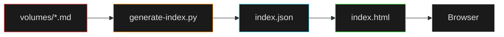

<h1 align="center">
  <span style="color:#e0e0e0;font-weight:800">📖 THE</span>
  <span style="color:#e0e0e0;font-weight:800">IT</span>
  <span style="color:#ff4444;font-weight:800">BIBLE</span>
</h1>
<p align="center">
  <span style="color:#888;font-size:11px;text-transform:uppercase;letter-spacing:2px;">Warnings From The Department</span>
</p>

<p align="center">A living encyclopedia of preventable suffering. Read this before your ticket becomes my problem.</p>

<p align="center">
  
  
  
  
  
  
  
</p>

---

## ⚠️ What This Is

A comprehensive (and brutally honest) guide to user errors that break systems. Each "book" covers a different flavor of chaos—from the classics ("I spilled coffee on it") to the existential ("How is this even possible?").

> [!NOTE]
> **✅ This is:**
> - Legitimate troubleshooting documentation
> - A public service announcement
> - A survival guide for IT professionals
> - Deeply cathartic

> [!CAUTION]
> **❌ This is NOT:**
> - A substitute for professional support
> - Legal permission to yell at your users
> - A reason to skip backups

---

## 📊 By The Numbers

<!-- STATS_START -->
> [!IMPORTANT]
> - **61 books** of warnings
> - **397 warnings** total
> - **1340 verses** (individual prevention tips)
> - **100% preventable** (if you read this first)
<!-- STATS_END -->

---

## 🚀 Get Started

### Quick Start (No Dependencies, No Nonsense)

<kbd>py serve.py</kbd>

Open **http://localhost:3000** and prepare yourself.

The frontend will load with a search-enabled sidebar, full warning text, and the ability to copy/download warnings as shareable images. Everything you need to weaponize this knowledge.

### What You Get

> [!TIP]
> - 🔍 **Full-text search** — Find that specific warning you need
> - 📋 **Copy functionality** — Paste warnings directly into tickets
> - 🖼️ **Image export** — Download warnings as <abbr title="Portable Network Graphics">PNG</abbr> for Slack/email/wall posters
> - 📱 **Mobile responsive** — Read warnings from your phone at 3 AM
> - ⚡ **Zero external dependencies** — Just Python and a browser

---

## 📚 The Books

<details>
<summary><strong>📚 Click to expand book list</strong></summary>

| Book | Focus | Warning Count |
|------|-------|---|
| 01 | General User Errors & <abbr title="Problem Exists Between Chair And Keyboard">PEBCAK</abbr> | 12 |
| 02 | Liquid & Physical Damage | 8 |
| ... | ... | ... |
| 61 | Afterword — The Last Warnings You Will Ever Need | 7 |

</details>

Browse them all in the web interface. Bookmark the ones you'll need.

---

## 🔧 Generating the Index

After adding or editing warnings, rebuild the search index:

<kbd>python generate-index.py</kbd>

The script scans all `.md` files in `volumes/`, extracts warnings, and generates `volumes/index.json` for the frontend. Takes seconds.



---

<details>
<summary><strong>📁 Project Structure</strong></summary>

```
├── volumes/                         # All book files (01-61)
│   ├── 01-general-user-errors.md
│   ├── ...
│   └── 61-afterword.md
│
├── version.json                     # Auto-updated stats
├── index.html                       # The UI you'll actually use
├── serve.py                         # Python dev server
├── start.bat                        # Windows double-click launcher
├── generate-index.py                # Index generator (Python)
├── generate-index.ps1               # Thin wrapper calling generate-index.py
├── .github/
│   ├── workflows/                   # <abbr title="Continuous Integration / Continuous Deployment">CI/CD</abbr>: auto-updates stats
│   └── scripts/                     # Stats calculator
└── README.md                        # This file
```

</details>

---

<details>
<summary><strong>🎯 Use Cases</strong></summary>

**<span style="color:#ff8800;">IT Professionals:</span>**  
Use this to build a personal knowledge base. Copy warnings into your ticket templates. Share specific warnings in Slack instead of writing the same explanation for the 47th time.

**<span style="color:#ff8800;">IT Managers:</span>**  
Send individual warnings to repeat offenders. Post warnings in common areas. Use this as evidence that some problems are genuinely user-induced.

**<span style="color:#ff8800;">Users (Who Actually Read):</span>**  
Learn what NOT to do before your device needs repair. Understand why IT people look tired. Appreciate the complexity hidden in "just rebooting it."

</details>

---

<details>
<summary><strong>💭 Philosophy</strong></summary>

> Every warning in this Bible is based on real support tickets. Real user errors. Real suffering.

The tone is harsh because the truth is harsh. But it's not cruel—it's cathartic. It's saying: *You are not alone. Your users do this too. It's not your fault.*

Except sometimes it is their fault. This book documents those times.

</details>

---

<details>
<summary><strong>📝 Contributing</strong></summary>

Found a new way users can break things? Have a warning that saved your sanity?

1. Add it to the appropriate chapter (or create a new one if it's truly novel)
2. Follow the existing format (title + bullet points + optional note)
3. Run `generate-index.py` to rebuild
4. Commit and push

The Bible grows as technology finds new ways to surprise us.

</details>

---

## ⚡ Quick Reference: Common Warnings

> [!WARNING]
> - **"I didn't change anything"** — Yes, you did. The system remembers.
> - **"The network is down"** — You're on Guest Wi-Fi.
> - **"Everything is broken"** — Be specific or be ignored.
> - **"I already rebooted"** — No, you didn't. Closing the lid isn't a reboot.
> - **"My computer hates me"** — Your computer is indifferent. You hate your computer.

---

## 📜 License

> [!NOTE]
> Public domain. Use freely. Blame me when your users get mad about being quoted.

---

## 🤝 Support

<details>
<summary><strong>🤝 Support</strong></summary>

**<span style="color:#ff8800;">Have a question?</span>** Read the warning first. The answer is probably in here.

**<span style="color:#ff8800;">Found a bug?</span>** Check if it's user error. It probably is.

**<span style="color:#ff8800;">Want to contribute?</span>** See the Contributing section above.

</details>

---

> *"In every user there is an IT story waiting to happen. This book documents those stories—and how to prevent them."*

<p align="center"><strong>Read The Bible. Save your sanity.</strong></p>
