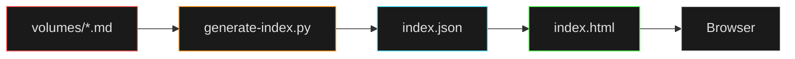

<h1 align="center">
  📖 THE
  IT
  BIBLE
</h1>

  Warnings From The Department

A living encyclopedia of preventable suffering. Read this before your ticket becomes my problem.

  
  
  
  
  
  
  

---

## ⚠️ What This Is

A comprehensive (and brutally honest) guide to user errors that break systems. Each "book" covers a different flavor of chaos—from the classics ("I spilled coffee on it") to the existential ("How is this even possible?").

> [!NOTE]
> **✅ This is:**
> - Legitimate troubleshooting documentation
> - A public service announcement
> - A survival guide for IT professionals
> - Deeply cathartic

> [!CAUTION]
> **❌ This is NOT:**
> - A substitute for professional support
> - Legal permission to yell at your users
> - A reason to skip backups

---

## 📊 By The Numbers

<!-- STATS_START -->
> [!IMPORTANT]
> - **61 books** of warnings
> - **397 warnings** total
> - **1340 verses** (individual prevention tips)
> - **100% preventable** (if you read this first)
<!-- STATS_END -->

---

## 🚀 Get Started

### Quick Start (No Nonsense)

<kbd>start.bat</kbd>

That's it. The script handles everything:
- Installs <kbd>uv</kbd> (if missing)
- Downloads/manages Python via <kbd>uv python install</kbd>
- Installs dependencies with <kbd>uv sync</kbd>
- Launches the server on **http://localhost:3000**

Already have Python? Just run <kbd>py serve.py</kbd> (TTS won't work without <kbd>uv sync</kbd>).

<kbd>py serve.py</kbd>

Open **http://localhost:3000** and prepare yourself.

The frontend will load with a search-enabled sidebar, full warning text, and the ability to copy/download warnings as shareable images. Everything you need to weaponize this knowledge.

### What You Get

> [!TIP]
> - 🔍 **Full-text search** — Find that specific warning you need
> - 📋 **Copy functionality** — Paste warnings directly into tickets
> - 🖼️ **Image export** — Download warnings as <abbr title="Portable Network Graphics">PNG</abbr> for Slack/email/wall posters
> - 🔊 **Text-to-Speech** — Hear warnings with Microsoft neural voices (optional: <kbd>uv sync</kbd>)
> - 📱 **Mobile responsive** — Read warnings from your phone at 3 AM

---

## 📚 The Books

<!-- BOOKS_START -->

<strong>📚 Click to expand book list</strong>

| # | Book | Warnings |
|---|------|---|
| 01 | [Classic PEBCAK & General User Errors](volumes/01-general-user-errors.md) | 12 |
| 02 | [Liquid Damage & Physical Destruction](volumes/02-liquid-and-physical-damage.md) | 8 |
| 03 | [Power, Shutdown & The Overheating Backpack Saga](volumes/03-power-shutdown-and-overheating.md) | 6 |
| 04 | [Passwords, Accounts & Digital Identity](volumes/04-passwords-and-accounts.md) | 5 |
| 05 | [Network, Internet & Printers](volumes/05-network-and-printers.md) | 6 |
| 06 | [Software, OS & The Windows Abyss](volumes/06-software-and-os.md) | 8 |
| 07 | [The "Expert" Relative & DIY Disasters](volumes/07-the-expert-relative-and-diy.md) | 6 |
| 08 | [Support Etiquette, Remote Sessions & Client Horror](volumes/08-support-etiquette-and-clients.md) | 10 |
| 09 | [AI Hallucinations & Modern Tech Nightmares](volumes/09-ai-and-modern-tech.md) | 7 |
| 10 | [Thoughts, Prayers & Spiritual IT Delusions](volumes/10-religious-and-spiritual.md) | 8 |
| 11 | [Banking, Home Networks & Budget Bandwidth](volumes/11-banking-and-home-network.md) | 8 |
| 12 | [Developers & Code Sins](volumes/12-developers-and-code-sins.md) | 10 |
| 13 | [The Hardware Graveyard](volumes/13-hardware-graveyard.md) | 8 |
| 14 | [Procurement Disasters](volumes/14-procurement-disasters.md) | 9 |
| 15 | [The "I Read an Article" Special](volumes/15-i-read-an-article-special.md) | 9 |
| 16 | [The "My Kid/Pet Did It" Defense](volumes/16-the-my-kid-pet-did-it-defense.md) | 5 |
| 17 | [Cable Management Crimes](volumes/17-cable-management-crimes.md) | 6 |
| 18 | [WhatsApp / Voice Note IT Support](volumes/18-whatsapp-voice-note-it-support.md) | 7 |
| 19 | [The Wrong Department](volumes/19-the-wrong-department.md) | 7 |
| 20 | [Meeting Room Tech Rituals](volumes/20-meeting-room-tech-rituals.md) | 7 |
| 21 | [Cloud / SaaS Confusion](volumes/21-cloud-saas-confusion.md) | 7 |
| 22 | [The Phishing Forwarder](volumes/22-the-phishing-forwarder.md) | 7 |
| 23 | [WFH / VPN Horror](volumes/23-wfh-vpn-horror.md) | 7 |
| 24 | [The "Can You Just..." Requests](volumes/24-the-can-you-just-requests.md) | 8 |
| 25 | [The Chair Whisperer](volumes/25-the-chair-whisperer.md) | 6 |
| 26 | [File Naming Crimes](volumes/26-file-naming-crimes.md) | 6 |
| 27 | [The Desk Tourist](volumes/27-the-desk-tourist.md) | 5 |
| 28 | [The Password Resetter](volumes/28-the-password-resetter.md) | 6 |
| 29 | [The Printer Hero](volumes/29-the-printer-hero.md) | 6 |
| 30 | [The Meeting That Could Have Been an Email](volumes/30-the-meeting-that-could-have-been-an-email.md) | 7 |
| 31 | [USB Stick Roulette](volumes/31-usb-stick-roulette.md) | 1 |
| 32 | [The "I Fixed It First" Disaster](volumes/32-the-i-fixed-it-first-disaster.md) | 5 |
| 33 | [The Escalation Abuser / CEO CC](volumes/33-the-escalation-abuser.md) | 6 |
| 34 | [The Reply-All Apocalypse](volumes/34-the-reply-all-apocalypse.md) | 6 |
| 35 | [The Update Denier](volumes/35-the-update-denier.md) | 7 |
| 36 | [The Keyboard Warrior](volumes/36-the-keyboard-warrior.md) | 5 |
| 37 | [The Tab Hoarder](volumes/37-the-tab-hoarder.md) | 5 |
| 38 | [The "Bring Your Own Everything"](volumes/38-the-bring-your-own-everything.md) | 5 |
| 39 | [The Spreadsheet Sorcerer](volumes/39-the-spreadsheet-sorcerer.md) | 5 |
| 40 | [The Silent Saboteur](volumes/40-the-silent-saboteur.md) | 6 |
| 41 | [I Asked the AI](volumes/41-i-asked-the-ai.md) | 5 |
| 42 | [The AI Prompt Engineer](volumes/42-the-ai-prompt-engineer.md) | 5 |
| 43 | [The "It Worked in Dev" Gambit](volumes/43-it-worked-in-dev.md) | 6 |
| 44 | [The Backup Gambler](volumes/44-the-backup-gambler.md) | 6 |
| 45 | [The License Pirate](volumes/45-the-license-pirate.md) | 6 |
| 46 | [The Screenshot That Isn't](volumes/46-the-screenshot-that-isnt.md) | 5 |
| 47 | [The "It Worked Yesterday" Expert](volumes/47-it-worked-yesterday.md) | 5 |
| 48 | [The Over-Explainer](volumes/48-the-over-explainer.md) | 5 |
| 49 | [The Karin Protocol](volumes/49-the-karin-protocol.md) | 8 |
| 50 | [The Karin Protocol v2: The Sequel](volumes/50-the-karin-protocol-v2.md) | 7 |
| 51 | [The Karin Protocol: Tech Shop v1](volumes/51-the-karin-protocol-tech-shop-v1.md) | 7 |
| 52 | [The Karin Protocol: Tech Shop v2](volumes/52-the-karin-protocol-tech-shop-v2.md) | 7 |
| 53 | [The Karin Protocol: The Meeting Menace](volumes/53-the-karin-protocol-meeting-menace.md) | 7 |
| 54 | [The Karin Protocol: The Password Apocalypse](volumes/54-the-karin-protocol-password-apocalypse.md) | 6 |
| 55 | [The Karin Protocol: The WFH Horror](volumes/55-the-karin-protocol-wfh-horror.md) | 7 |
| 56 | [The Karin Protocol: The Security Risk](volumes/56-the-karin-protocol-security-risk.md) | 6 |
| 57 | [The Karin Protocol: The Procurement Disaster](volumes/57-the-karin-protocol-procurement-disaster.md) | 6 |
| 58 | [The Karin Protocol: The Printer Warrior](volumes/58-the-karin-protocol-printer-warrior.md) | 6 |
| 59 | [The Karin Protocol: The Onboarding Disaster](volumes/59-the-karin-protocol-onboarding-disaster.md) | 6 |
| 60 | [The Karin Protocol: The Offboarding Escape](volumes/60-the-karin-protocol-offboarding-escape.md) | 6 |
| 61 | [Afterword — The Last Warnings You Will Ever Need](volumes/61-afterword-the-last-warnings.md) | 7 |

<!-- BOOKS_END -->

Browse them all in the web interface. Bookmark the ones you'll need.

---

## 🔧 Generating the Index

After adding or editing warnings, rebuild the search index:

<kbd>python generate-index.py</kbd>

The script scans all `.md` files in `volumes/`, extracts warnings, and generates `volumes/index.json` for the frontend. Takes seconds.

---

<strong>📁 Project Structure</strong>

<pre style="background:#0d1117;color:#c9d1d9;padding:16px;border-radius:8px;font-family:Consolas,'Courier New',monospace;line-height:1.7;overflow-x:auto;">
📂 volumes/                         # All book files (01-61)
  │
  ├── 01-general-user-errors.md
  ├── 02-liquid-and-physical-damage.md
  ├── ...
  └── 61-afterword-the-last-warnings.md
  │
📄 version.json                     # Auto-updated stats
📄 index.html                       # Browser frontend (search + export)
🐍 serve.py                         # Python dev server
🐍 generate-index.py                # Index generator (Python)
⚡ generate-index.ps1                # PowerShell wrapper
🪟 start.bat                        # Windows double-click launcher
  │
📁 .github/
  ├── workflows/                    # CI: auto-updates stats
  └── scripts/                      # Stats calculator
  │
📄 README.md                        # This file
</pre>

---

<strong>🎯 Use Cases</strong>

 

<blockquote style="border-left:4px solid #ff8800;padding:8px 16px;margin:0;">

<strong>🛠️ IT Professionals:</strong> 
Use this to build a personal knowledge base. Copy warnings into your ticket templates. Share specific warnings in Slack instead of writing the same explanation for the 47th time.

</blockquote>

 

<blockquote style="border-left:4px solid #ff8800;padding:8px 16px;margin:0;">

<strong>📋 IT Managers:</strong> 
Send individual warnings to repeat offenders. Post warnings in common areas. Use this as evidence that some problems are genuinely user-induced.

</blockquote>

 

<blockquote style="border-left:4px solid #ff8800;padding:8px 16px;margin:0;">

<strong>👤 Users (Who Actually Read):</strong> 
Learn what NOT to do before your device needs repair. Understand why IT people look tired. Appreciate the complexity hidden in "just rebooting it."

</blockquote>

---

<strong>💭 Philosophy</strong>

 

<blockquote style="border-left:4px solid #44ddff;padding:12px 20px;margin:0;background:#0d1117;border-radius:4px;">

<em>Every warning in this Bible is based on <strong>real support tickets</strong>. <strong>Real user errors.</strong> <strong>Real suffering.</strong></em>

</blockquote>

 

The tone is harsh because the truth is harsh. But it's not cruel—it's cathartic. It's saying: <em>You are not alone. Your users do this too. It's not your fault.</em>

<strong>Except sometimes it is their fault. This book documents those times.</strong>

---

<strong>📝 Contributing</strong>

 

Found a new way users can break things? Have a warning that saved your sanity?

<ol style="color:#c9d1d9;line-height:1.9;">
<li><strong>Add it</strong> to the appropriate chapter (or create a new one if it's truly novel)</li>
<li><strong>Follow the format</strong> — see the <a href="CONTRIBUTING.md" style="color:#44ddff;">sample template</a></li>
<li><strong>Rebuild</strong> the index: <code style="background:#1a1a1a;padding:2px 6px;border-radius:3px;">python generate-index.py</code></li>
<li><strong>Commit and push</strong> — CI auto-updates stats</li>
</ol>

The Bible grows as technology finds new ways to surprise us.

---

## ⚡ Quick Reference: Common Warnings

> [!WARNING]
> - **"I didn't change anything"** — Yes, you did. The system remembers.
> - **"The network is down"** — You're on Guest Wi-Fi.
> - **"Everything is broken"** — Be specific or be ignored.
> - **"I already rebooted"** — No, you didn't. Closing the lid isn't a reboot.
> - **"My computer hates me"** — Your computer is indifferent. You hate your computer.

---

## 📜 License

> [!NOTE]
> **Public domain.** Use freely. Blame me when your users get mad about being quoted.

---

## 🤝 Support

<strong>🤝 Support</strong>

**Have a question?** Read the warning first. The answer is probably in here.

**Found a bug?** Check if it's user error. It probably is.

**Want to contribute?** See the Contributing section above.

---

> *"In every user there is an IT story waiting to happen. This book documents those stories—and how to prevent them."*

<strong>Read The Bible. Save your sanity.</strong>

